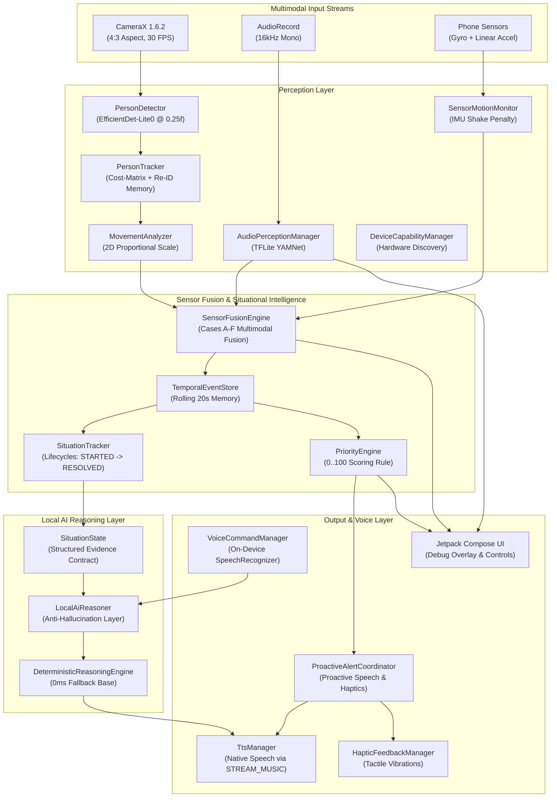

# Pulse 👁️🎙️📱

> **On-Device Spatial Perception, Situational Intelligence, Local AI Reasoning & Proactive Multimodal Engine for Wearable Smart Glasses & Smartphones.**

[](https://kotlinlang.org/)
[](https://developer.android.com/)
[](https://developer.android.com/training/camerax)
[](https://developers.google.com/mediapipe)
[](https://www.tensorflow.org/lite)

Pulse is an offline, privacy-first, on-device multimodal perception and situational intelligence engine designed for wearable camera glasses and smart assistive devices on Android. Operating 100% locally without cloud AI latency or network dependencies, Pulse fuses real-time camera frames, microphone audio streams, and phone IMU motion sensors into structured spatial memory, evolving situational lifecycles, local AI reasoning, tactile haptic pulses, and proactive natural language speech output.

---

## 🌟 Key Capabilities

### 👁️ On-Device Vision Perception Pipeline
* **High-Sensitivity Person Detection:** Uses MediaPipe Tasks Vision with `efficientdet_lite0.tflite` configured via CPU delegate and C++ category allowlisting. Threshold (`0.25f`) enables high-sensitivity detection of full bodies, upper bodies, close-ups, and side profiles.
* **Cost-Matrix Tracking & Smart Re-ID:** Unified cost-matrix tracker (`PersonTracker`) evaluating $Cost = (1 - IoU) \times 0.6 + DistRatio \times 0.4$ to prevent ID swapping when subjects cross paths. Features a **3-second short-term Re-ID memory** to maintain subject identities across brief occlusions.
* **2D Proportional Scale Trajectory Analysis:** `MovementAnalyzer` evaluates 2D area expansion (width AND height) over a 1.5s rolling window. Distinguishes actual physical approach ($\ge 10\%$ width & height growth) from stationary posture shifts (arm raising, crouching/standing in place) to eliminate false approach alerts.

### 🧭 Spatial Positioning & Proximity Awareness
* **Horizontal FOV Zones:** Divides 2D camera space into `LEFT` ($X < 35\%$), `CENTER` ($35\%\text{--}65\%$), and `RIGHT` ($X > 65\%$).
* **Distance Region Mapping:** Classifies relative distance into `NEAR` ($Height \ge 40\%$), `MID` ($20\%\text{--}40\%$), and `FAR` ($Height < 20\%$).
* **Natural Spatial Phrasing:** Formulates idiomatic spatial phrases (e.g. *"on your left nearby"*, *"in front of you"*).

### 📱 IMU Motion Fusion & Camera Shake Suppression
* **Sensor Motion Monitoring:** Monitors phone Gyroscope ($\ge 0.45\text{ rad/s}$) and Linear Acceleration ($\ge 1.20\text{ m/s}^2$) at ~50 Hz.
* **Camera Shake Penalty:** Fuses `CAMERA_STABLE` vs `CAMERA_MOVING` states to heavily penalize vision confidence ($-0.40f$) during phone camera movement, eliminating camera-shake false positives.

### 🎙️ On-Device Environmental Audio Perception (YAMNet)
* **16kHz Micro-Latency Audio Capture:** Captures audio off the UI thread via Android `AudioRecord` at 16kHz mono.
* **Sound Classification:** Runs TensorFlow Lite `AudioClassifier` (`yamnet.tflite`) detecting 8 key categories: `SPEECH`, `FOOTSTEPS`, `VEHICLE`, `VEHICLE_HORN`, `DOOR`, `DOORBELL`, `ALARM`, `SIREN`.
* **Temporal Debouncing:** Requires sound probability to persist across 3 consecutive 100ms audio windows (~300ms) before emitting a debounced `AudioEvent`.

### ⚡ Deterministic Sensor Fusion Engine
* **Multimodal Evidence Correlation (`SensorFusionEngine`):** Fuses Vision, Audio, and IMU observations across a 2-second temporal overlapping window.
* **Safety & Provenance Rules:**
  * **Approach + Footsteps + Stable Camera:** Boosts confidence conservatively (capped at `0.92f`).
  * **Vehicle Horn + Person:** Preserved as `AUDIO` source without falsely claiming the vehicle itself is visible.
  * **Audio-Alone Safety:** Audio events never invent visual person tracks.
  * **Audio-Silence Safety:** Lack of audio does not invalidate visual detection.

### 🧠 Situational Intelligence & Lifecycles
* **Evolving Situation Lifecycles:** `SituationTracker` correlates events over time into coherent, evolving situations (`STARTED` $\rightarrow$ `ESCALATING` $\rightarrow$ `ACTIVE` $\rightarrow$ `CHANGED` $\rightarrow$ `DE_ESCALATING` $\rightarrow$ `RESOLVED`).
* **Over-Announce Suppression:** Prevents repetitive speech unless situation importance changes, state transitions, or a new piece of evidence arrives.

### 🤖 Local AI Reasoning Layer
* **Structured Evidence Contract (`SituationState`):** Serializes active tracks, environmental sounds, recent events, and sensor states into a compact prompt contract consumed by `LocalAiReasoner`.
* **Anti-Hallucination Policy:** Grounded strictly in observed evidence. Never invents non-observed subjects, sounds, or actions. On local exception or unavailability, delegates seamlessly to `DeterministicReasoningEngine`.

### 🎙️ On-Device Explicit Voice Commands
* **Local-Only Speech Recognition:** Uses Android's native `SpeechRecognizer.createOnDeviceSpeechRecognizer` (`EXTRA_PREFER_OFFLINE = true`) without cloud fallback.
* **Deterministic Command Parser:** Maps spoken queries to core actions:
  * *"What's happening?"* / *"Is someone approaching?"* $\rightarrow$ `SHOW_CURRENT_SITUATION`
  * *"What just happened?"* $\rightarrow$ `SHOW_RECENT_EVENT_SUMMARY`
  * *"What changed?"* $\rightarrow$ `SHOW_CHANGES`
  * *"Repeat that"* $\rightarrow$ `REPEAT_LAST_RESPONSE`
  * *"Mute"* / *"Unmute"* $\rightarrow$ `MUTE_PROACTIVE_VOICE` / `UNMUTE_PROACTIVE_VOICE`
* **Microphone Coordination:** Pauses environmental audio perception during active voice input and restores it automatically on completion.

### 🔔 Priority Engine, Proactive Speech & Haptics
* **Deterministic Scoring (0–100):** Scores events based on semantics, proximity, speed, confidence, and motion penalties into `LOW`, `MEDIUM`, and `HIGH` priority levels.
* **Proactive Speech Gating:** `ProactiveAlertCoordinator` speaks `HIGH` priority alerts automatically with a 6-second cooldown and score-based interruption policy.
* **Tactile Haptic Feedback Channel:** `HapticFeedbackManager` delivers distinct tactile vibration patterns (`LOW` click, `MEDIUM` double pulse, `HIGH` urgent triple pulse) using standard public Android Vibrator APIs.

---

## 📐 System Architecture



---

## 📁 Repository Structure

```text
com.saikiran.pulse/
├── MainActivity.kt                      # Main Activity & Hardware Key Interceptor
├── audio/
│   ├── TtsManager.kt                    # Native Android TextToSpeech Manager (STREAM_MUSIC)
│   ├── haptics/
│   │   └── HapticFeedbackManager.kt    # Tactile Haptic Vibration Patterns
│   └── voice/
│       ├── VoiceCommandManager.kt       # On-Device SpeechRecognizer Manager
│       ├── CommandParser.kt             # Deterministic Voice Command Parser
│       ├── VoiceCommand.kt              # Voice Command Enum
│       └── VoiceCommandState.kt         # Voice Session Lifecycle State
├── camera/
│   └── CameraScreen.kt                  # Compose Screen, CameraX & Debug Panels
├── device/
│   ├── DeviceCapabilities.kt            # Hardware Capability Snapshot Model
│   ├── DeviceCapabilityManager.kt       # Programmatic Hardware Discovery
│   └── ThermalPowerManager.kt           # PowerManager Thermal Throttling Manager
├── perception/
│   ├── vision/
│   │   ├── PersonDetector.kt            # MediaPipe EfficientDet-Lite0 Detector
│   │   ├── PersonTracker.kt             # Cost-Matrix Tracker with 3s Re-ID Memory
│   │   ├── PersonAnalyzer.kt            # CameraX ImageAnalysis Frame Analyzer
│   │   ├── PersonOverlayView.kt         # Custom Canvas Bounding Box & Label Overlay
│   │   ├── movement/
│   │   │   └── MovementAnalyzer.kt      # 2D Proportional Scale Trajectory Classifier
│   │   └── spatial/
│   │       └── SpatialPosition.kt       # Horizontal Zone & Distance FOV Calculator
│   ├── audio/
│   │   ├── AudioPerceptionManager.kt    # TFLite YAMNet Audio Classifier (16kHz)
│   │   └── AudioEvent.kt                # Immutable Environmental Audio Event Model
│   └── sensors/
│       └── SensorMotionMonitor.kt       # Gyroscope & Linear Acceleration Monitor
└── engine/
    ├── evidence/
    │   ├── SituationState.kt            # Structured Evidence Contract
    │   ├── PersonState.kt               # Active Person Snapshot
    │   └── AudioEventState.kt           # Environmental Sound Snapshot
    ├── reasoning/
    │   ├── LocalReasoningEngine.kt      # Reasoning Interface
    │   ├── LocalAiReasoner.kt           # Local AI Reasoning Layer
    │   ├── DeterministicReasoningEngine.kt # 0ms Fallback Base Engine
    │   └── ReasoningResult.kt           # Reasoning Output Model
    ├── situation/
    │   ├── Situation.kt                 # Evolving Situation Data Model
    │   ├── SituationTracker.kt          # Event Correlation & Lifecycle Manager
    │   └── SituationLifecycleState.kt   # STARTED -> RESOLVED Enum
    ├── fusion/
    │   ├── SensorFusionEngine.kt        # Multimodal Fusion Engine (Cases A-F)
    │   └── FusedEvent.kt                # Fused Diagnostic Model
    ├── events/
    │   ├── TemporalEventStore.kt        # Thread-Safe Rolling 20s Event Store
    │   └── SemanticEventProcessor.kt    # Transition Deduplication State Machine
    ├── change/
    │   ├── ChangeDetector.kt            # Delta Tracking & Consumption Engine
    │   └── ChangeSummarizer.kt          # "What Changed?" Natural Language Summarizer
    ├── priority/
    │   ├── PriorityEngine.kt            # Deterministic 0..100 Priority Scoring Engine
    │   └── PriorityDecision.kt          # Priority Decision Data Model
    ├── alerts/
    │   └── ProactiveAlertCoordinator.kt # Bridges HIGH Priority Decisions to TTS & Haptics
    └── summary/
        └── EventSummarizer.kt           # "What Just Happened?" Natural Language Engine
```

---

## 🛠️ Prerequisites & Setup

### Requirements
* **Android Studio:** 2024.1+ (Ladybug / Jellyfish or newer).
* **JDK:** Java 11 / 17.
* **Android SDK:** `minSdk = 26` (Android 8.0+), `targetSdk = 37`.
* **Hardware:** Physical Android smartphone with Camera & Microphone (Tested on OnePlus Nord 4 & iQOO).

### Building & Running
1. **Clone the Repository:**
   ```bash
   git clone https://github.com/garlapati3105-cmd/Pulse.git
   cd Pulse
   ```

2. **Open in Android Studio:**
   Open project folder and perform a Gradle Sync.

3. **Run Unit Tests:**
   ```bash
   ./gradlew testDebugUnitTest
   ```

4. **Build Debug APK:**
   ```bash
   ./gradlew app:assembleDebug
   ```

5. **Build Release APK:**
   ```bash
   ./gradlew app:assembleRelease
   ```

---

## 🎯 Usage Instructions

1. **Launch App:** Grant Camera, Microphone, and Vibration permissions when prompted.
2. **Point Camera:** Direct camera toward people walking or moving nearby.
3. **Proactive Voice & Haptic Alerts:**
   * High-urgency events automatically speak spatial warnings (*"Someone is approaching from your left"*) and trigger distinct haptic vibration pulses.
4. **Explicit Voice Commands (Hands-Free):**
   * Tap **`🎙️ VOICE COMMAND`** button (or press Volume keys) and speak naturally:
     * *"What's happening?"* $\rightarrow$ Speaks current situation summary aloud.
     * *"What just happened?"* $\rightarrow$ Speaks 20s rolling history summary.
     * *"What changed?"* $\rightarrow$ Speaks unconsumed change deltas.
     * *"Repeat that"* $\rightarrow$ Re-speaks last summary.
     * *"Mute"* / *"Unmute"* $\rightarrow$ Toggles proactive speech output.
5. **Hardware Shortcuts:**
   * **Click Volume Up:** Speaks *"What Just Happened?"*.
   * **Click Volume Down:** Speaks *"What Changed?"*.
6. **Developer Debug Panels:** Real-time on-screen telemetry for Priority Decisions, Proactive Audits, Audio Perception, Sensor Fusion, Local AI Reasoning, and Voice Commands.

---

## 📜 License

This project is licensed under the Apache 2.0 License.
