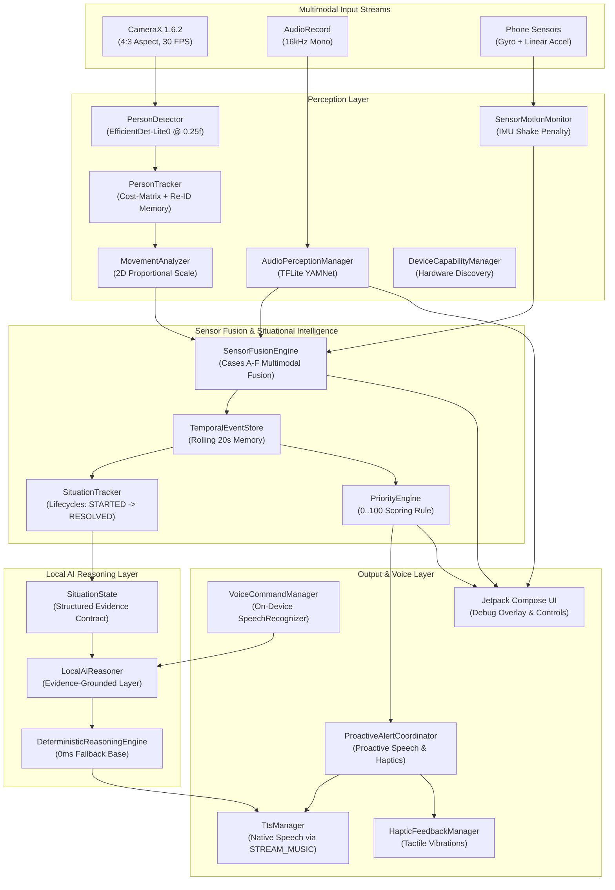

# Pulse 👁️🎙️📱

> **A hands-free AI that tells you what is happening around you — not just what is in front of the camera.**

[](https://kotlinlang.org/)
[](https://developer.android.com/)
[](https://developer.android.com/training/camerax)
[](https://developers.google.com/mediapipe)
[](https://www.tensorflow.org/lite)

Pulse is an offline, privacy-first, on-device multimodal situational intelligence system built for Android smartphones and wearable smart camera devices. The core Pulse perception, memory, sensor fusion, and reasoning pipeline is designed to run on-device without requiring a cloud AI service, continuously transforming live camera frames, microphone streams, and phone IMU motion sensors into structured spatial memory, evolving situation lifecycles, and proactive natural language speech output.

Designed around hands-free accessibility and real-world awareness, Pulse does not require the user to repeatedly point, tap, and ask for descriptions. Instead, it continuously perceives the environment in real time, filters out camera motion noise, tracks moving subjects across time and spatial zones, and proactively communicates critical events as they unfold.

---

## 🎯 What is Pulse?

Pulse is a phone-first, hands-free situational awareness assistant. It acts as an ambient perceptual layer on your smartphone, monitoring your surrounding physical space and translating raw sensory input into natural, spoken situational descriptions. 

Rather than treating every video frame or audio clip as an isolated observation, Pulse constructs an evolving memory of active situations—understanding when someone enters your field of view, walks toward you from your left, stops nearby, or exits the scene.

---

## 🧩 The Problem

Most visual AI tools available today are **request-driven**:
```text
Point Phone → Capture Frame → Send to Cloud → Receive Isolated Description
```

This interaction model has fundamental limitations for continuous, hands-free situational awareness:
1. **High Friction:** Users must constantly hold up the phone, target a scene, tap a button, and wait for a response.
2. **Zero Memory:** Request-driven APIs analyze single isolated frames without memory of what happened two seconds ago.
3. **Cloud Latency & Privacy Risks:** Streaming continuous live video to cloud servers introduces significant latency, cellular data bandwidth overhead, and severe privacy concerns.

Pulse solves this by shifting to **continuous situational awareness**:
```text
Observe → Detect → Track → Fuse → Remember → Understand → Prioritize → Communicate
```

---

## 💡 How Pulse is Different

* **Continuous Situational Awareness:** Runs continuously on-device in real-time, eliminating manual point-and-query friction.
* **Multimodal Sensor Fusion:** Combines CameraX vision, YAMNet audio classification, and phone IMU motion sensors into a single, unified reasoning layer.
* **Temporal Memory (20-Second Store):** Retains a rolling 20-second history of events to understand movement trajectories and state transitions.
* **Proactive Speech & Haptic Alerts:** Automatically speaks high-priority warnings (*"Someone is approaching from your left"*) and triggers tactile vibration patterns without requiring user prompts.
* **Evidence-Grounded Local Reasoning:** Employs a structured evidence contract (`SituationState`) and local reasoning layer with zero-latency deterministic fallbacks, designed to prevent unsupported subjects, sounds, or actions from being introduced into responses.
* **Hands-Free Control:** Supports physical volume button hotkeys and offline on-device voice queries (*"What's happening?"*, *"What changed?"*).

---

## 🎥 Demo

> *Demo video link: Coming soon.*

### Example Interactions

**Example 1: Situational Query**
> **User:** *"What's happening?"*  
> **Pulse:** *"Someone is approaching from your left. I can hear footsteps."*

**Example 2: Follow-Up State Query**
> **User:** *"Is that person still approaching?"*  
> **Pulse:** *"They are now nearby and stationary."*

**Example 3: Unconsumed Delta Query**
> **User:** *"What changed?"*  
> **Pulse:** *"A person stopped in front of you and is now moving away."*

---

## ⚡ Core Experience

```text
Observe → Detect → Track → Fuse → Remember → Understand → Prioritize → Communicate
```

1. **Observe:** Captures synchronized CameraX video, microphone PCM audio, and IMU sensor data.
2. **Detect:** Identifies human subjects (`efficientdet_lite0.tflite`) and environmental sounds (`yamnet.tflite`).
3. **Track:** Maintains persistent track identities (`PERSON_1`) across time and 3-second temporary occlusions.
4. **Fuse:** Correlates vision, audio, and camera-shake states into deterministic `FusedEvent`s.
5. **Remember:** Stores chronological events in a thread-safe, rolling 20-second event store (`TemporalEventStore`).
6. **Understand:** Tracks evolving situation lifecycles (`STARTED` $\rightarrow$ `ESCALATING` $\rightarrow$ `ACTIVE` $\rightarrow$ `CHANGED` $\rightarrow$ `RESOLVED`).
7. **Prioritize:** Scores situational urgency ($0\text{--}100$) using spatial proximity, speed, and confidence.
8. **Communicate:** Speaks high-urgency alerts and tactile haptic pulses aloud via native Android TTS.

---

## 🌟 Key Capabilities

### 👁️ Vision Perception
* **Person Detection:** MediaPipe Tasks Vision (`efficientdet_lite0.tflite` @ `0.25f` threshold) with MediaPipe category allowlisting for the `person` class, enabling high-sensitivity detection of full bodies, upper bodies, close-ups, and side profiles.
* **Cost-Matrix Tracking:** Unified cost-matrix tracking ($Cost = (1 - IoU) \times 0.6 + DistRatio \times 0.4$) ensuring ID stability when subjects cross paths, backed by 3-second Re-ID memory.
* **2D Proportional Scale Analysis:** Evaluates 2D width AND height expansion over 1.5s windows to distinguish physical approach ($\ge 10\%$ scale growth) from stationary posture shifts (arm raising, crouching/standing in place) to filter out detector jitter.

### 🧭 Spatial Awareness
* **Horizontal FOV Partitioning:** Divides camera field of view into `LEFT` ($X < 35\%$), `CENTER` ($35\%\text{--}65\%$), and `RIGHT` ($X > 65\%$).
* **Distance Mapping:** Maps relative subject height into `NEAR` ($\ge 40\%$), `MID` ($20\%\text{--}40\%$), and `FAR` ($< 20\%$).
* **Natural Phrasing:** Generates spoken phrases like *"on your left nearby"* or *"in front of you"*.

### 📱 Motion Understanding
* **Sensor Motion Monitoring:** Evaluates Gyroscope ($\ge 0.45\text{ rad/s}$) and Linear Acceleration ($\ge 1.20\text{ m/s}^2$) at ~50 Hz.
* **Camera Shake Penalty:** Heavily penalizes vision confidence ($-0.40f$) during camera movement (`CAMERA_MOVING`), preventing false approach warnings while walking or panning the phone.

### 🎙️ Environmental Audio
* **Micro-Latency Capture:** Captures 16kHz mono PCM audio via Android `AudioRecord`.
* **Sound Classification:** TFLite `AudioClassifier` (`yamnet.tflite`) detecting 8 key categories: `SPEECH`, `FOOTSTEPS`, `VEHICLE`, `VEHICLE_HORN`, `DOOR`, `DOORBELL`, `ALARM`, `SIREN`.
* **Temporal Debouncing:** Requires sound probability to persist across 3 consecutive 100ms audio windows (~300ms) before emitting events.

### 🔗 Sensor Fusion
* **Multimodal Correlation:** Fuses Vision, Audio, and IMU observations across a 2-second overlapping window (`SensorFusionEngine`).
* **Safety & Provenance Rules:** Audio events never invent visual person tracks; lack of audio does not invalidate vision; vehicle horns are preserved as audio events without claiming a vehicle is visible unless visual vehicle evidence exists.
* **Conservative Calibration:** Fused confidence is capped at `0.92f` to avoid false certainty.

### 🧠 Temporal & Situational Intelligence
* **20-Second Memory Store:** Thread-safe rolling event store (`TemporalEventStore`) with automatic 20s eviction.
* **Change Detector:** Tracks unconsumed state deltas (*"What Changed?"*) and drains the queue upon query to prevent repeating identical changes.
* **Situation Lifecycles:** `SituationTracker` tracks situation states: `STARTED` $\rightarrow$ `ESCALATING` $\rightarrow$ `ACTIVE` $\rightarrow$ `CHANGED` $\rightarrow$ `DE_ESCALATING` $\rightarrow$ `RESOLVED`.

### 🤖 Local Reasoning Layer
* **Structured Evidence Contract:** Serializes active subjects, sounds, recent events, and sensor states into `SituationState`.
* **Evidence-Grounded Policy:** `LocalAiReasoner` generates responses grounded strictly in observed evidence, with 0ms fallback to `DeterministicReasoningEngine`. The architecture is designed to support local model-backed reasoning over structured evidence.

### 🎙️ Hands-Free Voice Interaction
* **On-Device Speech Recognition:** Uses Android's native `SpeechRecognizer.createOnDeviceSpeechRecognizer` (`EXTRA_PREFER_OFFLINE = true`) without cloud speech APIs.
* **Deterministic Command Parser:** Maps spoken queries to core commands (*"What's happening?"*, *"What changed?"*, *"Repeat"*, *"Mute"* / *"Unmute"*).
* **Microphone Coordination:** Pauses environmental audio classification during active voice listening and restores it automatically on completion.

### 🔔 Proactive Speech & Haptics
* **Priority Scoring (0–100):** Scores events deterministically based on semantics, proximity, speed, confidence, and motion penalties into `LOW`, `MEDIUM`, and `HIGH` levels.
* **Proactive Speech Gating:** `ProactiveAlertCoordinator` automatically speaks `HIGH` priority alerts with a 6-second cooldown and score-based interruption policy.
* **Tactile Haptic Feedback Channel:** `HapticFeedbackManager` delivers distinct tactile vibration patterns (`LOW` click, `MEDIUM` double pulse, `HIGH` urgent triple pulse) using standard public Android Vibrator APIs.

---

## 🏗️ System Architecture



---

## 🛠️ Tech Stack

| Layer | Technology | Function |
| :--- | :--- | :--- |
| **Language** | Kotlin 2.2.10 | Core application & perception engine logic |
| **UI Framework** | Jetpack Compose (BOM 2026.02.01) | Declarative UI, debug panels, and controls |
| **Camera** | CameraX 1.6.2 | 30 FPS 4:3 image analysis & preview pipeline |
| **Vision Model** | MediaPipe Tasks Vision (0.10.14) | `efficientdet_lite0.tflite` on-device object detection |
| **Audio Model** | TensorFlow Lite Task Audio (0.4.4) | `yamnet.tflite` 16kHz environmental sound classifier |
| **Sensors** | Android SensorManager | Gyroscope & Linear Acceleration motion monitoring |
| **Speech Recognition** | Android On-Device SpeechRecognizer | Offline, single-shot voice command parsing |
| **Voice Output** | Android TextToSpeech | Native speech synthesis routed via `STREAM_MUSIC` |
| **Haptics** | Android Vibrator / VibrationEffect | Tactile feedback channel for priority alerts |
| **Local Reasoning** | Deterministic & Evidence-Grounded Engine | Zero-latency, evidence-grounded situation reasoning |

---

## 🔒 Privacy & On-Device Processing

The core Pulse perception, memory, sensor fusion, and reasoning pipeline is designed to run on-device without requiring a cloud AI service.

* **Camera Processing:** Camera frames are processed directly in memory on a background thread and immediately closed; no video frames are recorded or transmitted over the network.
* **Audio Perception:** Audio classification operates on local $100\text{ ms}$ PCM buffers in memory; no audio recordings are saved or uploaded.
* **Voice Commands:** Uses Android's on-device speech recognition (`EXTRA_PREFER_OFFLINE = true`) without cloud speech APIs.
* **Local Memory & Reasoning:** Event stores, situation trackers, and reasoning engines operate entirely in phone RAM without external server communication.

---

## 📁 Repository Structure

```text
com.saikiran.pulse/
├── MainActivity.kt                      # Main Activity & Hardware Key Interceptor
├── audio/
│   ├── TtsManager.kt                    # Native Android TextToSpeech Manager (STREAM_MUSIC)
│   ├── haptics/
│   │   └── HapticFeedbackManager.kt    # Tactile Haptic Vibration Patterns
│   └── voice/
│       ├── VoiceCommandManager.kt       # On-Device SpeechRecognizer Manager
│       ├── CommandParser.kt             # Deterministic Voice Command Parser
│       ├── VoiceCommand.kt              # Voice Command Enum
│       └── VoiceCommandState.kt         # Voice Session Lifecycle State
├── camera/
│   └── CameraScreen.kt                  # Compose Screen, CameraX & Debug Panels
├── device/
│   ├── DeviceCapabilities.kt            # Hardware Capability Snapshot Model
│   ├── DeviceCapabilityManager.kt       # Programmatic Hardware Discovery
│   └── ThermalPowerManager.kt           # PowerManager Thermal Throttling Manager
├── perception/
│   ├── vision/
│   │   ├── PersonDetector.kt            # MediaPipe EfficientDet-Lite0 Detector
│   │   ├── PersonTracker.kt             # Cost-Matrix Tracker with 3s Re-ID Memory
│   │   ├── PersonAnalyzer.kt            # CameraX ImageAnalysis Frame Analyzer
│   │   ├── PersonOverlayView.kt         # Custom Canvas Bounding Box & Label Overlay
│   │   ├── movement/
│   │   │   └── MovementAnalyzer.kt      # 2D Proportional Scale Trajectory Classifier
│   │   └── spatial/
│   │       └── SpatialPosition.kt       # Horizontal Zone & Distance FOV Calculator
│   ├── audio/
│   │   ├── AudioPerceptionManager.kt    # TFLite YAMNet Audio Classifier (16kHz)
│   │   └── AudioEvent.kt                # Immutable Environmental Audio Event Model
│   └── sensors/
│       └── SensorMotionMonitor.kt       # Gyroscope & Linear Acceleration Monitor
└── engine/
    ├── evidence/
    │   ├── SituationState.kt            # Structured Evidence Contract
    │   ├── PersonState.kt               # Active Person Snapshot
    │   └── AudioEventState.kt           # Environmental Sound Snapshot
    ├── reasoning/
    │   ├── LocalReasoningEngine.kt      # Reasoning Interface
    │   ├── LocalAiReasoner.kt           # Evidence-Grounded Reasoning Layer
    │   ├── DeterministicReasoningEngine.kt # 0ms Fallback Base Engine
    │   └── ReasoningResult.kt           # Reasoning Output Model
    ├── situation/
    │   ├── Situation.kt                 # Evolving Situation Data Model
    │   ├── SituationTracker.kt          # Event Correlation & Lifecycle Manager
    │   └── SituationLifecycleState.kt   # STARTED -> RESOLVED Enum
    ├── fusion/
    │   ├── SensorFusionEngine.kt        # Multimodal Fusion Engine (Cases A-F)
    │   └── FusedEvent.kt                # Fused Diagnostic Model
    ├── events/
    │   ├── TemporalEventStore.kt        # Thread-Safe Rolling 20s Event Store
    │   └── SemanticEventProcessor.kt    # Transition Deduplication State Machine
    ├── change/
    │   ├── ChangeDetector.kt            # Delta Tracking & Consumption Engine
    │   └── ChangeSummarizer.kt          # "What Changed?" Natural Language Summarizer
    ├── priority/
    │   ├── PriorityEngine.kt            # Deterministic 0..100 Priority Scoring Engine
    │   └── PriorityDecision.kt          # Priority Decision Data Model
    ├── alerts/
    │   └── ProactiveAlertCoordinator.kt # Bridges HIGH Priority Decisions to TTS & Haptics
    └── summary/
        └── EventSummarizer.kt           # "What Just Happened?" Natural Language Engine
```

---

## 🚀 Getting Started

### Prerequisites
* **Android Studio:** Android Studio compatible with the project's current Gradle/Android Gradle Plugin configuration.
* **JDK:** JDK compatible with the project's Gradle configuration.
* **Android SDK:** `minSdk = 26` (Android 8.0+), `targetSdk = 37`.
* **Physical Android Device:** Recommended for full testing because Pulse requires a physical camera, microphone, gyroscope, and acceleration sensors.

### Building & Running
1. **Clone the Repository:**
   ```bash
   git clone https://github.com/garlapati3105-cmd/Pulse.git
   cd Pulse
   ```

2. **Run Local Unit Tests:**
   ```bash
   ./gradlew testDebugUnitTest
   ```

3. **Build Debug APK:**
   ```bash
   ./gradlew app:assembleDebug
   ```

4. **Build Release APK:**
   ```bash
   ./gradlew app:assembleRelease
   ```

---

## 🎙️ Usage

1. **Launch App:** Grant Camera, Microphone, and Vibration permissions when prompted.
2. **Point Camera:** Direct camera toward people walking or moving nearby.
3. **Proactive Voice & Haptic Alerts:**
   * High-urgency events automatically speak spatial warnings (*"Someone is approaching from your left"*) and trigger distinct haptic vibration pulses.
4. **Hands-Free Voice Commands:** Tap **`🎙️ VOICE COMMAND`** button (or press Volume keys) and speak naturally:
   * *"What's happening?"* $\rightarrow$ Speaks current situation summary aloud.
   * *"What just happened?"* $\rightarrow$ Speaks 20s rolling history summary.
   * *"What changed?"* $\rightarrow$ Speaks unconsumed change deltas.
   * *"Repeat that"* $\rightarrow$ Re-speaks last summary.
   * *"Mute"* / *"Unmute"* $\rightarrow$ Toggles proactive speech output.
5. **Hardware Shortcuts:**
   * **Click Volume Up:** Speaks *"What Just Happened?"*.
   * **Click Volume Down:** Speaks *"What Changed?"*.
6. **Developer Debug Panels:** Real-time on-screen telemetry for Priority Decisions, Proactive Audits, Audio Perception, Sensor Fusion, Local AI Reasoning, and Voice Commands.

---

## ✅ Validation & Current Status

Build and unit-test validation is currently passing across the codebase:

* **Latest Unit-Test Run:** **`21/21 PASSED`** (`100% Unit Test Pass Rate`).
* **Debug Build:** `app-debug.apk` (**$98.6\text{ MB}$**, `BUILD SUCCESSFUL`).
* **Release Build:** `app-release-unsigned.apk` (**$93.35\text{ MB}$**, `BUILD SUCCESSFUL`).
* **GitHub Synchronization:** Main branch up to date at [https://github.com/garlapati3105-cmd/Pulse.git](https://github.com/garlapati3105-cmd/Pulse.git).

> *Note: `PULSE_PHASE_8_VALIDATION_REPORT.md` documents an earlier Phase 8 validation run with 8/8 tests passed; the repository has since added additional tests.*

---

## ⚠️ Current Limitations

* **Smartphone-First Implementation:** Pulse is implemented and tested as an Android smartphone application; dedicated wearable smart-glass hardware display integration represents a future roadmap direction.
* **Camera Field-of-View Mapping:** Spatial positioning (`LEFT`/`CENTER`/`RIGHT`, `NEAR`/`MID`/`FAR`) is calculated relative to the 2D camera FOV rather than absolute 3D world coordinates.
* **On-Device Speech Model Dependencies:** On-device speech command recognition relies on the availability of Android's system-level offline speech recognition package (`SpeechRecognizer.isOnDeviceRecognitionAvailable`).

---

## 🗺️ Roadmap

### ✅ Completed
* Core CameraX 30 FPS vision perception
* MediaPipe EfficientDet-Lite0 person detection
* Cost-matrix tracking with 3s Re-ID memory
* 2D proportional scale trajectory analysis
* IMU sensor motion fusion & camera-shake penalty
* TFLite YAMNet 16kHz environmental audio classification
* Multimodal Sensor Fusion Engine (Cases A–F)
* Thread-safe 20s temporal event store & change detector
* Deterministic Priority Engine ($0\text{--}100$ scoring)
* Proactive voice alerts with score interruption
* Tactile haptic feedback channel (`LOW`, `MEDIUM`, `HIGH`)
* On-device offline voice command recognition
* Structured evidence contract (`SituationState`)
* Local reasoning layer with 0ms deterministic fallback
* Situational Intelligence & evolving situation lifecycles

### 🔄 In Progress / Next
* iQOO / smartphone device optimization
* Physical-device field validation
* CPU / RAM / latency / thermal profiling
* Final UX and accessibility polish
* Final demo video & submission preparation

### 🔭 Future Directions
* Bluetooth wearable audio headset routing
* Wearable smart-glass HUD display integration
* App Bundle (`.aab`) ABI split optimization ($\sim 28\text{ MB}$ download footprint)

---

## 📜 License

This project is licensed under the Apache 2.0 License.
