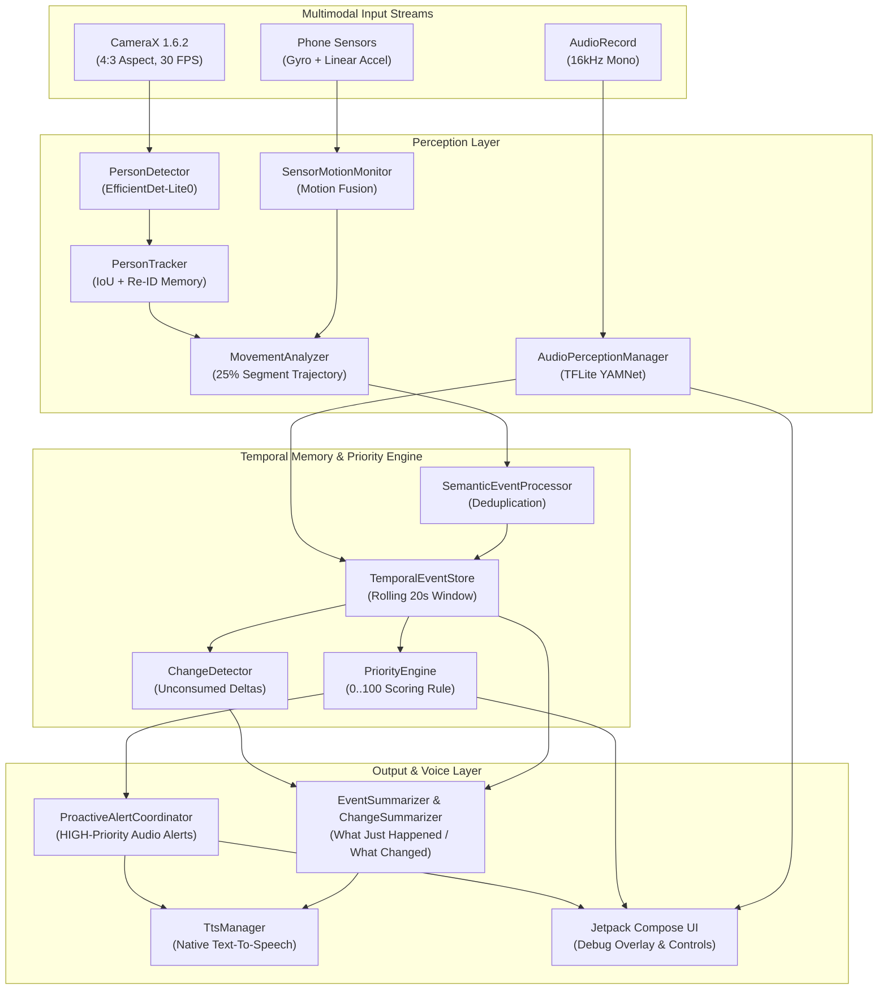

# Pulse 👁️🎙️📱

> **On-Device Spatial Perception, Temporal Event Memory & Proactive Multimodal Intelligence Engine for Wearable Smart Glasses on Android.**

[](https://kotlinlang.org/)
[](https://developer.android.com/)
[](https://developer.android.com/training/camerax)
[](https://developers.google.com/mediapipe)
[](https://www.tensorflow.org/lite)

Pulse is a real-world, privacy-first, on-device multimodal perception engine designed for wearable smart camera glasses and assistive vision devices on Android. Operating completely offline without cloud AI latency or bandwidth dependencies, Pulse continuously converts raw camera frames, microphone streams, and phone IMU motion sensors into structured spatial memory, deterministic priority decisions, and proactive natural language speech output.

---

## 🌟 Key Capabilities

### 👁️ On-Device Vision Perception Pipeline
* **High-Efficiency Person Detection:** Uses MediaPipe Tasks Vision with `efficientdet_lite0.tflite` configured via CPU delegate and C++ category allowlisting. Optimized threshold (`0.25f`) enables high-sensitivity detection of full bodies, upper bodies, close-ups, and side profiles.
* **Temporal Tracking & Smart Re-ID:** Lightweight IoU + Centroid Distance tracker (`PersonTracker`) with Exponential Moving Average (EMA) box smoothing. Features a **3-second short-term Re-ID memory** to maintain subject identities (`PERSON_1`) across brief occlusions or frame exits.
* **25% Segment Trajectory Classification:** Classifies movement trajectories into `APPROACHING`, `STOPPED`, `MOVING_AWAY`, `PASSING_BY`, or `STATIONARY` using segment-endpoint height expansion and vector analysis.
* **Approach Speed & Urgency Detection:** Calculates height expansion rate ($\Delta Height / dt \ge 18\%/\text{s}$) to flag fast approaches for high-urgency alerts (*"Warning! Someone is approaching quickly on your left"*).

### 🧭 Spatial Positioning & Distance Awareness
* **Horizontal FOV Zones:** Divides 2D camera space into `LEFT` ($X < 35\%$), `CENTER` ($35\%\text{--}65\%$), and `RIGHT` ($X > 65\%$).
* **Distance Region Mapping:** Classifies relative distance into `NEAR` ($Height \ge 40\%$), `MID` ($20\%\text{--}40\%$), and `FAR` ($Height < 20\%$).
* **Natural Spatial Language:** Combines spatial attributes into natural English phrases (e.g. *"on your left nearby"*, *"in front of you"*).

### 📱 IMU Motion Fusion & Camera Shake Suppression
* **Sensor Motion Monitoring:** Monitors phone Gyroscope ($\ge 0.45\text{ rad/s}$) and Linear Acceleration ($\ge 1.20\text{ m/s}^2$) at ~50 Hz.
* **Camera Shake Penalty:** Fuses `CAMERA_STABLE` vs `CAMERA_MOVING` states to penalize vision confidence during phone camera movement, eliminating false positive motion events.

### 🎙️ On-Device Environmental Audio Perception (YAMNet)
* **16kHz Micro-Latency Audio Capture:** Captures audio off the UI thread via Android `AudioRecord` at 16kHz mono (YAMNet native format).
* **Sound Classification:** Runs TensorFlow Lite `AudioClassifier` (`yamnet.tflite`) detecting 8 key categories: `SPEECH`, `FOOTSTEPS`, `VEHICLE`, `VEHICLE_HORN`, `DOOR`, `DOORBELL`, `ALARM`, `SIREN`.
* **Temporal Debouncing:** Requires sound probability to persist across 3 consecutive 100ms audio windows (~300ms) before emitting a debounced `AudioEvent`.

### 🧠 Temporal Memory & Deterministic Priority Engine
* **Thread-Safe Rolling Event Store:** Retains chronological events in a synchronized 20-second rolling window (`TemporalEventStore`).
* **Semantic State Machine:** Suppresses duplicate frame observations and emits clean transition events (`PERSON_ENTERED_VIEW`, `PERSON_TRACK_LOST`, `PERSON_LEFT_VIEW`).
* **Priority Engine (0–100 Scoring):** Deterministically scores events based on base semantics, spatial proximity, speed, confidence, and motion penalties to compute `LOW`, `MEDIUM`, or `HIGH` priority levels.
* **Proactive Voice Alerts:** `ProactiveAlertCoordinator` automatically speaks `HIGH` priority spatial alerts (*"Someone is approaching from your left"*) with a 6-second deduplication cooldown and score-based interruption policy.

### 🔊 Accessibility & Hands-Free Interaction
* **Natural Language Queries:**
  * **"WHAT JUST HAPPENED?"**: Summarizes the entire 20-second rolling event memory into 1–2 idiomatic English sentences.
  * **"WHAT CHANGED?"**: Drains and summarizes unconsumed state deltas since the user's last check.
* **Hardware Volume Key Shortcuts:** Single-click Volume Up (*"What Just Happened?"*) and Volume Down (*"What Changed?"*).
* **UI Controls:** `PROACTIVE VOICE: ON/OFF` and `MUTE: ON/OFF` header toggles.
* **Developer Debug Panels:** Real-time on-screen telemetry for Vision Overlay, Priority Decisions, Proactive Audits, and Audio Perception.

---

## 📐 System Architecture



---

## 📁 Repository Structure

```text
com.saikiran.pulse/
├── MainActivity.kt                      # Main Activity & Hardware Key Interceptor
├── audio/
│   └── TtsManager.kt                    # Native Android TextToSpeech Manager
├── camera/
│   └── CameraScreen.kt                  # Compose Screen, CameraX & Debug Panels
├── perception/
│   ├── vision/
│   │   ├── PersonDetector.kt            # MediaPipe EfficientDet-Lite0 Detector
│   │   ├── PersonTracker.kt             # IoU + Centroid Tracker with 3s Re-ID Memory
│   │   ├── PersonAnalyzer.kt            # CameraX ImageAnalysis Frame Analyzer
│   │   ├── PersonOverlayView.kt         # Custom Canvas Bounding Box & Label Overlay
│   │   ├── movement/
│   │   │   └── MovementAnalyzer.kt      # Trajectory & Approach Speed Classifier
│   │   └── spatial/
│   │       └── SpatialPosition.kt       # Horizontal Zone & Distance FOV Calculator
│   ├── audio/
│   │   ├── AudioPerceptionManager.kt    # TFLite YAMNet Audio Classifier (16kHz)
│   │   └── AudioEvent.kt                # Immutable Environmental Audio Event Model
│   └── sensors/
│       └── SensorMotionMonitor.kt       # Gyroscope & Linear Acceleration Monitor
└── engine/
    ├── events/
    │   ├── TemporalEventStore.kt        # Thread-Safe Rolling 20s Event Store
    │   └── SemanticEventProcessor.kt    # Transition Deduplication State Machine
    ├── change/
    │   ├── ChangeDetector.kt            # Delta Tracking & Consumption Engine
    │   └── ChangeSummarizer.kt          # "What Changed?" Natural Language Summarizer
    ├── priority/
    │   ├── PriorityEngine.kt            # Deterministic 0..100 Priority Scoring Engine
    │   └── PriorityDecision.kt          # Priority Decision Data Model
    ├── alerts/
    │   └── ProactiveAlertCoordinator.kt # Bridges HIGH Priority Decisions to TTS
    └── summary/
        └── EventSummarizer.kt           # "What Just Happened?" Natural Language Engine
```

---

## 🛠️ Prerequisites & Setup

### Requirements
* **Android Studio:** 2024.1+ (Ladybug / Jellyfish or newer).
* **JDK:** Java 11 / 17.
* **Android SDK:** `minSdk = 26` (Android 8.0+), `targetSdk = 37`.
* **Hardware:** Physical Android device with Camera & Microphone (Tested on OnePlus Nord 4).

### Building & Running
1. **Clone the Repository:**
   ```bash
   git clone https://github.com/garlapati3105-cmd/Pulse.git
   cd Pulse
   ```

2. **Open in Android Studio:**
   Open the project folder in Android Studio and perform a Gradle Sync.

3. **Build Debug APK:**
   ```bash
   ./gradlew app:assembleDebug
   ```

4. **Install & Run on Device:**
   ```bash
   ./gradlew app:installDebug
   ```

---

## 🎯 Usage Instructions

1. **Launch App:** Grant Camera and Microphone permissions when prompted.
2. **Point Camera:** Direct camera toward people walking or moving nearby.
3. **Proactive Alerts:** Toggle **`PROACTIVE VOICE: ON`** in top header to receive automatic spoken alerts (*"Someone is approaching from your left"*).
4. **Hardware Shortcuts:**
   * **Click Volume Up:** Speaks *"What Just Happened?"* (summarizes recent 20s history).
   * **Click Volume Down:** Speaks *"What Changed?"* (summarizes new changes since last query).
5. **Debug Telemetry:** Inspect real-time Priority Scores, Proactive Audit Logs, and Audio Perception states in top debug panels.

---

## 📜 License

This project is licensed under the Apache 2.0 License.
